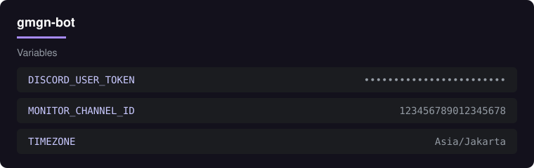
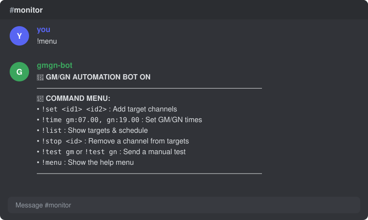
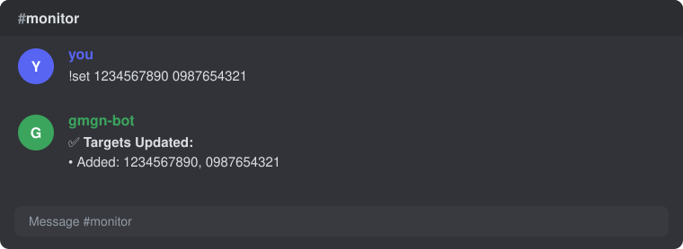
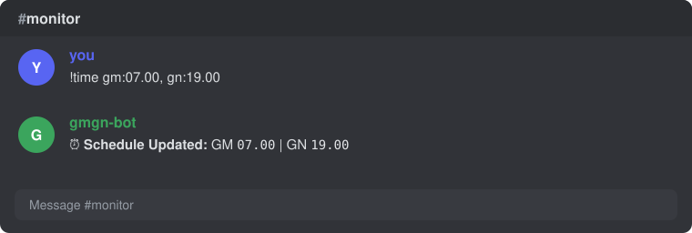
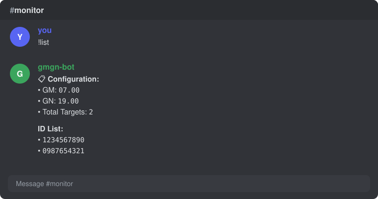
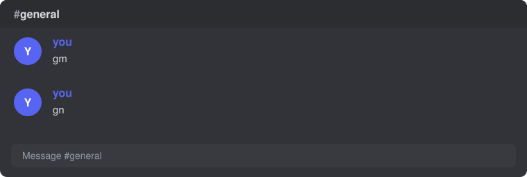

<div align="center">


# GM/GN Bot

<p>
  <a href="https://www.python.org/"></a>
  <a href="https://discord.com/"></a>
  <a href="Dockerfile"></a>
  <a href="https://railway.app/"></a>
  <a href="https://docs.pytest.org/"></a>
  <a href="https://docs.astral.sh/ruff/"></a>
  <a href="LICENSE"></a>
</p>

<p><a href="README.md">Bahasa Indonesia</a> · <a href="README.en.md">English</a></p>

<p><b>Kirim GM &amp; GN otomatis ke banyak channel Discord.</b> Pesan dipilih dengan sistem rarity supaya natural, jadwal dan target diatur lewat perintah teks di satu channel pemantau. Berjalan sebagai worker di Railway, tanpa dashboard dan tanpa database.</p>

<p>
  <a href="#coba-sekarang">Coba sekarang</a> ·
  <a href="#fitur">Fitur</a> ·
  <a href="#cara-pakai">Cara pakai</a> ·
  <a href="#format-input">Format input</a> ·
  <a href="#privasi">Privasi</a> ·
  <a href="#pengembangan">Pengembangan</a> ·
  <a href="#kontribusi">Kontribusi</a>
</p>

</div>

---

## Coba sekarang

Tiga langkah dari nol sampai bot aktif:

1. **Deploy** repo ini ke Railway lewat **Deploy from GitHub repo** ([railway.app/new](https://railway.app/new)).
2. Isi tiga **Variables**: `DISCORD_USER_TOKEN`, `MONITOR_CHANNEL_ID`, `TIMEZONE`, lalu tambahkan **Volume** yang di-mount ke `/data`.
3. Buka channel pemantau dan ketik:

```
!set 1234567890 0987654321
!time gm:07.00, gn:19.00
!list
```

Selesai: bot akan mengirim `gm` dan `gn` ke channel target sesuai jam yang diatur. Penjelasan lengkap ada di [Cara pakai](#cara-pakai).

> **Peringatan:** bot ini memakai akun pengguna (self-bot) yang melanggar Ketentuan Layanan Discord. Baca bagian [Privasi](#privasi) dan [Kontribusi](#kontribusi) sebelum memakainya.

## Fitur

**Pengiriman pesan**

- **Sistem rarity pesan**: pesan singkat (`gm` / `gn`) muncul paling sering, sedangkan variasi kalimat lain muncul acak sebagai selingan sehingga tidak terlihat seperti robot.
- **Multi-channel**: satu bot untuk banyak channel target sekaligus.
- **Jeda acak antar pengiriman** (*human-like delay*) agar tidak terlihat seperti spam.
- **Jadwal GM dan GN terpisah**, dengan zona waktu yang bisa diatur lewat `TIMEZONE` (mis. `Asia/Jakarta`, `Asia/Makassar`).

**Kontrol dan keamanan operasional**

- **Panel kontrol lewat perintah teks**: `!menu`, `!set`, `!time`, `!list`, `!stop`, `!test`. Tidak perlu mengubah kode atau re-deploy untuk mengganti target dan jadwal.
- **Channel pemantau terkunci**: perintah hanya direspons di channel yang ditentukan lewat `MONITOR_CHANNEL_ID`.
- **Konfigurasi persisten** di `/data/config.json` (Railway Volume), tidak hilang saat restart atau re-deploy.

**Kualitas kode**

- Kode dipecah per modul (settings, storage, messages, scheduler, commands, client).
- Tes perilaku dengan **pytest**, lint dan format dengan **Ruff**.
- Siap produksi dengan **Dockerfile** dan **Procfile**.

## Cara pakai

**1. Deploy dan isi environment variable.** Ikuti [Deploy ke Railway](#deploy-ke-railway). Setelah bot aktif, ia mengirim status di channel pemantau.



**2. Lihat daftar perintah** dengan `!menu` di channel pemantau.



**3. Tambahkan channel target** dengan `!set` diikuti satu atau banyak ID channel, dipisah spasi.



**4. Atur jam kirim** dengan `!time`. Jam GM dan GN diisi dalam satu perintah.



**5. Periksa konfigurasi** dengan `!list` untuk melihat jam GM dan GN, jumlah target, dan daftar ID target aktif.



**6. Bot mengirim pesan** ke channel target pada jam yang diatur.



**7. Hapus target** kapan saja dengan `!stop 1234567890`.

## Format input

### Perintah

Semua perintah **hanya bekerja di channel pemantau**.

| Perintah | Fungsi | Contoh |
| -------- | ------ | ------ |
| `!menu` | Menampilkan panduan bantuan | `!menu` |
| `!set` | Menambah satu atau banyak ID channel target | `!set 1234567890 0987654321` |
| `!time` | Mengatur jam kirim otomatis GM dan GN | `!time gm:07.00, gn:19.00` |
| `!list` | Menampilkan konfigurasi aktif dan daftar ID target | `!list` |
| `!stop` | Menghapus ID channel dari daftar target | `!stop 1234567890` |
| `!test` | Mengirim tes GM atau GN secara manual ke semua target | `!test gm` |

Aturan singkat:

- ID channel dipisah **spasi** pada `!set`.
- Jam ditulis dengan **titik** (`07.00`), pasangan `gm:` dan `gn:` dipisah **koma** pada `!time`.
- Cara mengambil ID channel: aktifkan **Developer Mode** di Discord (Pengaturan > Lanjutan), klik kanan channel, pilih **Copy Channel ID**.

### Environment variable

Contoh lengkap ada di `.env.example`.

| Variabel | Contoh | Keterangan |
| -------- | ------ | ---------- |
| `DISCORD_USER_TOKEN` | `MTI3...` | Token akun Discord yang dipakai bot (**rahasia**) |
| `MONITOR_CHANNEL_ID` | `123456789012345678` | Channel tempat bot mengirim status dan menerima perintah |
| `TIMEZONE` | `Asia/Jakarta` | Zona waktu acuan jadwal |

### Penyimpanan

Target dan jadwal disimpan di `/data/config.json`. Pastikan folder `/data` berasal dari **Railway Volume** agar berkas ini bertahan saat container dibuat ulang.

## Privasi

- Token **hanya** disimpan di environment variable Railway. Jangan pernah meng-commit token; `.env.example` hanya berisi contoh tanpa token asli.
- Bot tidak menyediakan layanan web, tidak memakai database, dan tidak memakai analytics. Satu-satunya data yang disimpan adalah `config.json` berisi ID channel target dan jadwal.
- Token setara dengan password akun. Kalau bocor, **ganti password akun** untuk me-reset token.
- Gunakan **akun khusus**, bukan akun utama.
- Bot ini mengotomatisasi akun pengguna (self-bot), yang **melanggar Ketentuan Layanan Discord**. Akun bisa dibatasi atau dibanned. Pakai dengan risiko sendiri.

## Pengembangan

Butuh Python dan pip. Jalankan dari root repo.

### Menjalankan lokal

```
pip install -r requirements.txt
pip install -e .
```

Linux / macOS:

```
export DISCORD_USER_TOKEN=token_anda
export MONITOR_CHANNEL_ID=123456789012345678
export TIMEZONE=Asia/Jakarta
python -m gmgn_bot
```

Windows (CMD):

```
set DISCORD_USER_TOKEN=token_anda
set MONITOR_CHANNEL_ID=123456789012345678
set TIMEZONE=Asia/Jakarta
python -m gmgn_bot
```

### Tes dan lint

```
pip install -r requirements-dev.txt
pytest
ruff check .
ruff format --check .
```

### Menjalankan dengan Docker

```
docker build -t gmgn-bot .
docker run --env-file .env -v gmgn-data:/data gmgn-bot
```

### Deploy ke Railway

1. Buat repository baru di GitHub, lalu push isi folder ini.
2. Buka <https://railway.app/>, buat proyek baru, pilih **Deploy from GitHub repo**, lalu hubungkan ke repository tersebut.
3. Di menu **Variables**, tambahkan `DISCORD_USER_TOKEN`, `MONITOR_CHANNEL_ID`, dan `TIMEZONE`.
4. Tambahkan **Volume** dan mount ke `/data` agar `config.json` tetap tersimpan.
5. Railway otomatis build memakai `Dockerfile` dan menjalankan worker sesuai `Procfile`.

### Tech stack

- **Python** dengan layout `src/`, dijalankan lewat `python -m gmgn_bot`
- **Dockerfile** dan **Procfile** untuk Railway
- **pytest** untuk tes perilaku, **Ruff** untuk lint dan format
- Konfigurasi persisten berupa satu berkas JSON, tanpa database

### Struktur folder

```
src/gmgn_bot/
  __init__.py           Ekspor publik paket
  __main__.py           Titik masuk: python -m gmgn_bot
  settings.py           Baca dan validasi env var (satu tempat)
  storage.py            Baca/tulis config.json
  messages.py           Kumpulan pesan + pemilihan rarity
  scheduler.py          Logika jadwal dan pengiriman berkala
  commands.py           Parser dan handler !menu/!set/!time/!list/!stop/!test
  client.py             Pembuatan client Discord dan event handler tipis
  logging_setup.py      Konfigurasi logging
tests/                  Tes perilaku (pytest)
docs/                   Logo dan screenshot untuk README
.env.example            Contoh variabel lingkungan (tanpa token asli)
pyproject.toml          Konfigurasi ruff dan pytest
requirements.txt        Dependensi runtime (versi disematkan)
requirements-dev.txt    Dependensi development (pytest, ruff)
Dockerfile              Container untuk Docker/Railway
Procfile                Perintah eksekusi worker
```

### Batasan yang diketahui

- **Perintah hanya di channel pemantau**; di channel lain bot tidak merespons.
- **Tanpa Volume, konfigurasi hilang** saat container dibuat ulang.
- **Risiko akun**: pengiriman otomatis lewat akun pengguna bisa memicu pembatasan dari Discord, dan sebagian server melarang pesan otomatis. Patuhi aturan tiap server.

## Kontribusi

Kontribusi sangat diterima.

1. **Fork** repo ini dan buat branch baru, mis. `fitur/nama-fitur`.
2. Pasang dependensi development: `pip install -r requirements-dev.txt`.
3. Ubah kode di `src/gmgn_bot/`, **tambahkan atau perbarui tes** di `tests/`.
4. Pastikan semuanya lolos sebelum membuka PR:

   ```
   pytest
   ruff check .
   ruff format --check .
   ```

5. Buka **Pull Request** dengan deskripsi singkat: apa yang berubah dan kenapa.

Untuk bug atau usulan fitur, buka **Issue** dan sertakan langkah mengulang serta log (tanpa token).

Proyek ini tidak berafiliasi dengan Discord Inc. Dirilis di bawah lisensi [MIT](LICENSE).
